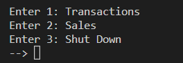
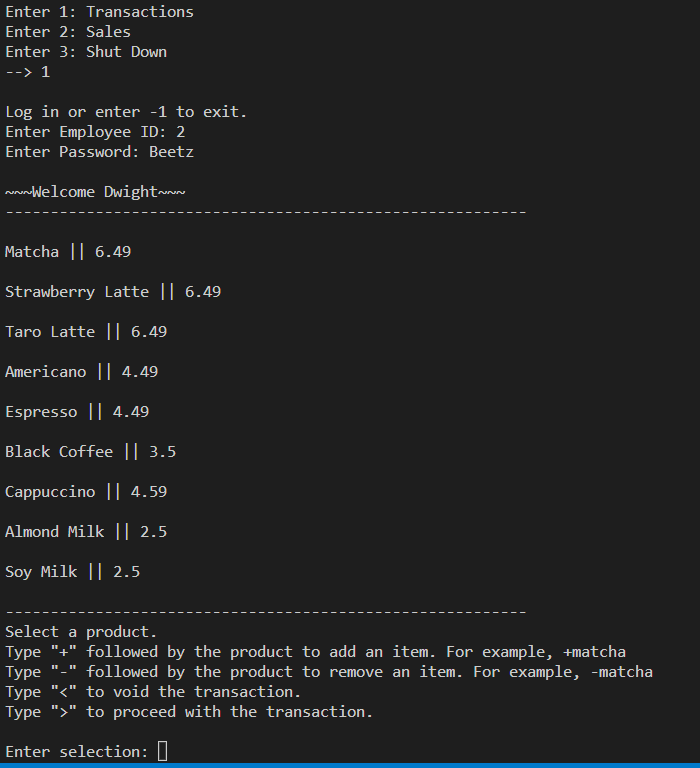
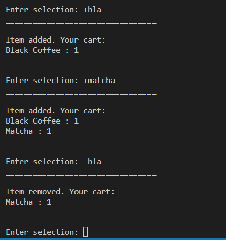
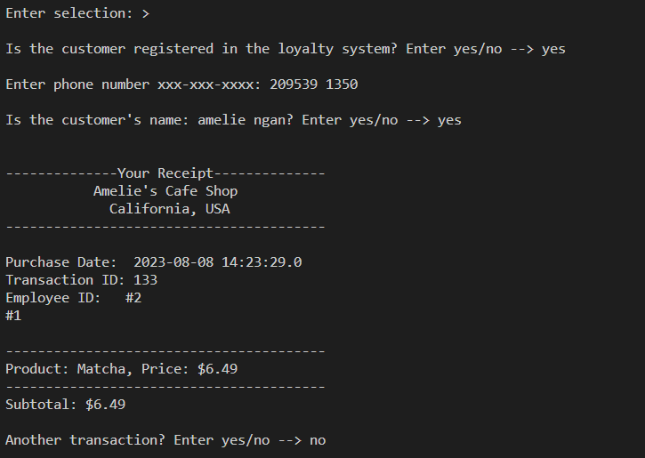
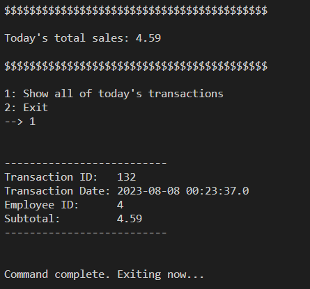
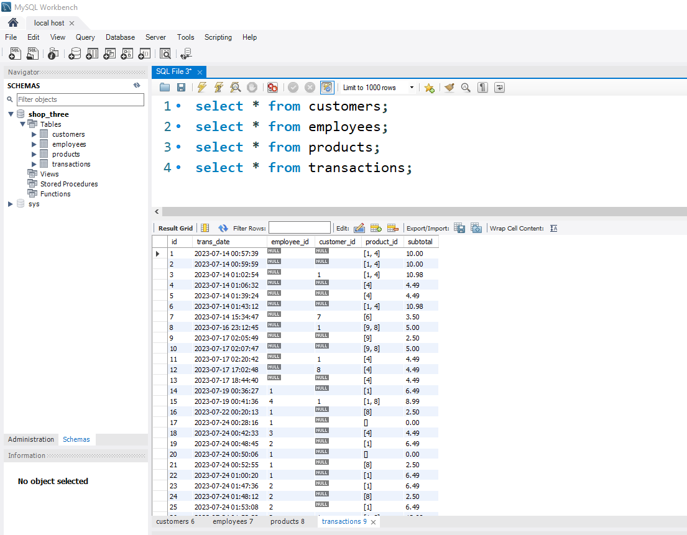

# Point of Sale (POS) System

The Point of Sale (POS) system is an application designed to handle transactions in a simulated cafe shop. 
It provides functionality for managing products, facilitating and processing transactions, and generating receipts.

The application is built using Java and utilizes a MySQL database for data storage.
It also utilizes the `bcrypt` library to securely store employees' hashed passwords for log-ins. 
The program generates log outputs based on events using Java's logging utility. 

## Table of Contents

1. [Classes and Functionality](#classes-and-functionality)
   - [CartSelection](#cartselection)
   - [CustomerManager](#customermanager)
   - [DatabaseManager](#databasemanager)
   - [EmployeeManager](#employeemanager)
   - [HomePOS](#homepos)
   - [InputValidation](#inputvalidation)
   - [LoggingUtility](#loggingutility)
   - [ProductManager](#productmanager)
   - [SalesPOS](#salespos)
   - [TransactionPOS](#transactionpos)
2. [Screenshots](#screenshots)
3. [Database Configuration](#database-config)
4. [Log Output](#log-output)

## Classes and Functionality 

### CartSelection 
   - This class provides functionality for managing the cart in the point-of-sale application. It allows users to display, add, and remove products from the cart. 

### CustomerManager 
   - Manages customers' information and sign-ups in the point-of-sale application. Eseentially, it handles new and returning customers.

### DatabaseManager 
   - This class serves as the entry point for the POS application. It establishes a connection with the database and launches the POS system's homepage.

### EmployeeManager 
   - Handles employee log-ins for the point-of-sale application. Verifies employee credentials using employee ID and password.

### HomePOS 
   - The "homepage" of the POS system. Provides a menu with options to navigate to the transaction and sales functionalities. Also handles shutdown processes.

### InputValidation 
   - Utility class for validating user inputs, including "yes/no" answers, valid phone numbers, and integers.

### LoggingUtility 
   - Provides a centralized consistent logging mechanism for the application. Captures log messages for different log levels and outputs them to a log file.

### ProductManager 
   - Handles operations related to managing products in the database. Provides methods to display all products, add new products, update existing products, and remove products.

### SalesPOS 
   - Manages the display of total sales and today's transaction details. Provides functionality to view today's total sales amount and retrieve all transaction information.

### TransactionPOS 
   - Manages point-of-sale transactions for employees. Provides functionalities for displaying products, choosing items for purchase, customer's information (retrieval or signup), calculating subtotals, logging transactions into the database, and generating transaction receipts.

## Screenshots 

Here you can find screenshots of the expected console output of the POS system:

- Homepage:
   - 
  
- Transaction Functionality Page:
   - 
   - 

- Receipt Example:
   - 

- Sales Functionality Page:
   - 

## Database Setup 

The application connects to a MySQL database for storing product, employee, customer, and transaction information. 
The database connection is established using the `DatabaseManager` class. 

To use the POS system, import the `pos_database_dump.sql` file, which contains the entire MySQL database dump, provided in the repository.
The database consists of 4 tables: customers (ID, name, phone number), employees (ID, name, pay, hire_date, password),
products (ID, name, price), and transactions (ID, date, FK_employee_ID, FK_customer_ID, product ID, subtotal).

### To set up the database:
1. Make sure you have MySQL installed on your system.
2. Create a new database with the desired name (e.g., my_database) using MySQL command-line or a tool like MySQL Workbench.
3. Import the SQL file into your MySQL database using one of the following methods:
   
         Command Line:
            ``bash
            mysql -u username -p database_name < pos_database_dump.sql

         MySQL Workbench:
            Open MySQL Workbench, connect to your MySQL server, and open a new SQL tab. Copy/import the content of pos_database_dump.sql into the tab, 
            and then execute the script to create the database schema and populate it with sample data.

4. Editing Configuration in DatabaseManager class:

   Open the DatabaseManager class and locate the following lines:

            String url = "jdbc:mysql://localhost:3306/shop_three";
            String username = "root";
            String password = "password";

      Modify url, username, and password according to your MySQL configuration.
      Run the DatabaseManager class, and it will establish a connection to the database and launch the POS system's homepage.

### Screenshots of the Expected Database Output:
   

## Log Output 

   The log file for the POS system isn't a part of this repository to keep it untracked since it's updated with each run of the program. 
   To offer a glimpse of the log output's structure, a sample log file named `sample_logs.txt` is included in the repository. 
   These sample logs have been extracted from the actual log file and are provided for reference to showcase the formatting and content of the log entries.
   
   Additionally, the log file is also being used by a different python script. 
   As such, the log file is inside the root directoy where this repository and the python's repository is located,
   rather than have it ignored by .gitignore
    
   
